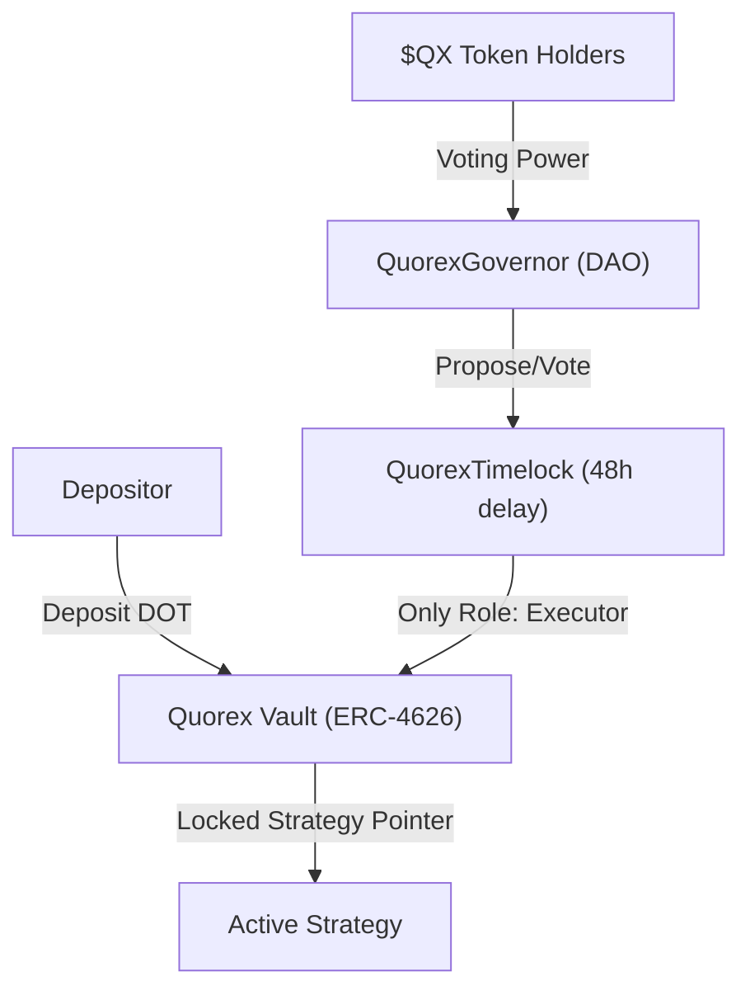

# 💎 Quorex — The Un-Ruggable DeFi Vault 🏆

**Polkadot Solidity Hackathon 2026**  
*Tracks: EVM Smart Contract · OpenZeppelin Sponsor ($1,000)*

---

## 🦾 The 2026 Cyber-Crystal Interface

Quorex isn't just a vault; it's a state-of-the-art financial terminal. Our **Cyber-Crystal & Midnight Slate** design system is engineered for institutional confidence, featuring:

- **Asymmetric Bento Hero**: A modern data-first entry point for real-time protocol health.
- **Glassmorphism Command Center**: A multi-layered dashboard for strategy monitoring.
- **PVM-Enforced Security**: Visual safety proofs for every consensus-driven action.

---

## 🛑 The Problem
**$3.1 billion** was stolen from DeFi vaults in 2024.

Euler ($197M), Yearn, Beefy, Hundred Finance — different protocols, same root cause every time: **one private key with unilateral control over user funds.** Multisigs are better, but they are still trusted parties that can be coerced, compromised, or simply go rogue.

There is no DeFi vault today where strategy changes are *enforced on-chain* to require governance approval. That gap is what **Quorex** closes.

---

## ✅ The Solution
Quorex is a yield vault deployed on **Polkadot Hub** where **the smart contract itself enforces** the governance model. No admin key exists. No multisig holds power. Strategy changes only happen after:

1. A proposal passes a DAO vote by **$QX** token holders.
2. A mandatory **48-hour TimelockController delay** expires.

Neither step can be skipped. Not by the deployer. Not by anyone.



---

## 🔗 Live Deployment — Polkadot Hub Testnet

| Contract | Address |
| :--- | :--- |
| **Quorex Vault (ERC-4626)** | `0x8d5F49d27A63de5024FAbAA6780C33e90198d517` |
| **Quorex Governor** | `0xBd756ccCDa138EaB3C3E640a313D8D1758c798D5` |
| **Quorex Timelock (48h)** | `0x36903E42B7eBb8332fDfeebDa50a74B9b59fC7d2` |
| **$QX Token (ERC20Votes)** | `0x6704377C9cEf610Ad53624855584A3BCcae94667` |

> **Block explorer**: [Polkadot Hub Testnet — SocialScan](https://polkadot-hub-testnet.socialscan.io)

---

## 🕹️ Demo
- **Live App**: [quorex-vault.vercel.app](https://github.com/ShivamSoni20/Quorex)
- **Walkthrough**: [Explore Documentation](./walkthrough.md)

### 📸 Visualizing the Future — interface Preview

| Hero Interface | Command Center | Consensus Engine |
| :--- | :--- | :--- |
|  |  |  |

---

## ⚙️ How It Works

### 1. Depositing
- Connect MetaMask to Polkadot Hub Testnet.
- Approve DOT spend → Deposit into Quorex Vault.
- Receive vault shares + **$QX governance tokens** proportional to your deposit.
- Yield accrues automatically from the active strategy.

### 2. Governance Lifecycle
1.  **Propose**: Any $QX holder submits a strategy rotation proposal on-chain.
2.  **Vote**: $QX holders cast FOR / AGAINST / ABSTAIN votes. All votes are on-chain transactions, not off-chain snapshots.
3.  **Queue**: If quorum is met and proposal passes, it is queued in the TimelockController.
4.  **Wait**: 48-hour mandatory delay. During this window, any depositor can exit if they disagree.
5.  **Execute**: After the delay, anyone can trigger execution. The vault rotates to the new strategy automatically.

### 3. Withdrawing
- Burn vault shares at any time (unless vault is governance-paused) to receive DOT + accrued yield.

---

## 🛡️ OpenZeppelin Contracts — Track Compliance
Quorex uses five OpenZeppelin 5.x contracts in a non-trivial composition. No contract is used as a standalone vanilla deployment.

| OZ Contract | Used In | Non-Trivial Usage |
| :--- | :--- | :--- |
| `ERC4626` | QuorexVault | `setStrategy()` gated to `TIMELOCK_ROLE` only. `totalAssets()` reads from active strategy. |
| `Governor` + `Votes` | QuorexGovernor | Routes all executions through TimelockController. Checkpointed voting prevents flash loan attacks. |
| `TimelockController`| QuorexTimelock | `TIMELOCK_ADMIN_ROLE` renounced post-deploy — no backdoor. Open executor (`address(0)`). |
| `ERC20Votes` | $QX Token | Minted on deposit, burned on withdrawal. Gasless approvals via Permit. |
| `AccessControl` | QuorexVault | `GUARDIAN_ROLE` can pause deposits/withdrawals only — cannot touch strategy or governance. |

> **Security Note**: The `TIMELOCK_ADMIN_ROLE` renouncement is verified on-chain. Call `QuorexTimelock.hasRole(DEFAULT_ADMIN_ROLE, deployerAddress)` — it returns `false`.

---

## 💻 Tech Stack
- **Smart Contracts**: Solidity 0.8.26, OpenZeppelin 5.x, Hardhat
- **Blockchain**: Polkadot Hub Testnet (EVM, chainId: 420420417)
- **Frontend**: React 18, TypeScript, Vite
- **Web3 Layer**: wagmi v2, viem v2, MetaMask injected connector
- **Styling**: Tailwind CSS v4, Syne + Space Mono fonts

---

## 🛠️ Local Setup

### Smart Contracts
```bash
cd governed-vault-hardhat
npm install
# Add DEPLOYER_PRIVATE_KEY to .env
# Deploy to Polkadot Hub Testnet
npx hardhat run scripts/deploy.ts --network polkadotHubTestnet
```

### Frontend
```bash
# In the root directory
pnpm install
# Fill in contract addresses in .env.local
pnpm dev
# App runs at http://localhost:5173
```

---

## 🏛️ Security Model
| Threat | Quorex Response |
| :--- | :--- |
| **Admin key compromise** | No admin key exists. `DEFAULT_ADMIN_ROLE` was renounced at deployment. |
| **Malicious strategy update** | `setStrategy()` is `onlyRole(TIMELOCK_ROLE)`. Only TimelockController can call it. |
| **Rushed governance attack** | 48-hour delay is enforced by TimelockController code, not policy. |
| **Flash loan attack** | `ERC20Votes` checkpointing — voting power is read at the snapshot, not current block. |

---

## 👨‍💻 Team
**Shivam Soni** — Smart contracts, frontend, deployment  
GitHub: [@ShivamSoni20](https://github.com/ShivamSoni20)

---

*Open-source. MIT License. Built for the Polkadot Solidity Hackathon 2026.*
